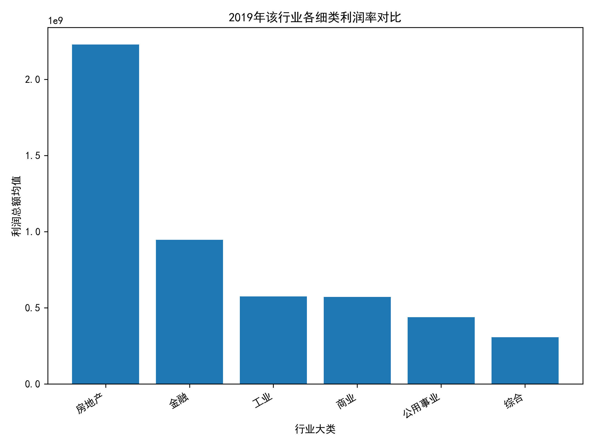
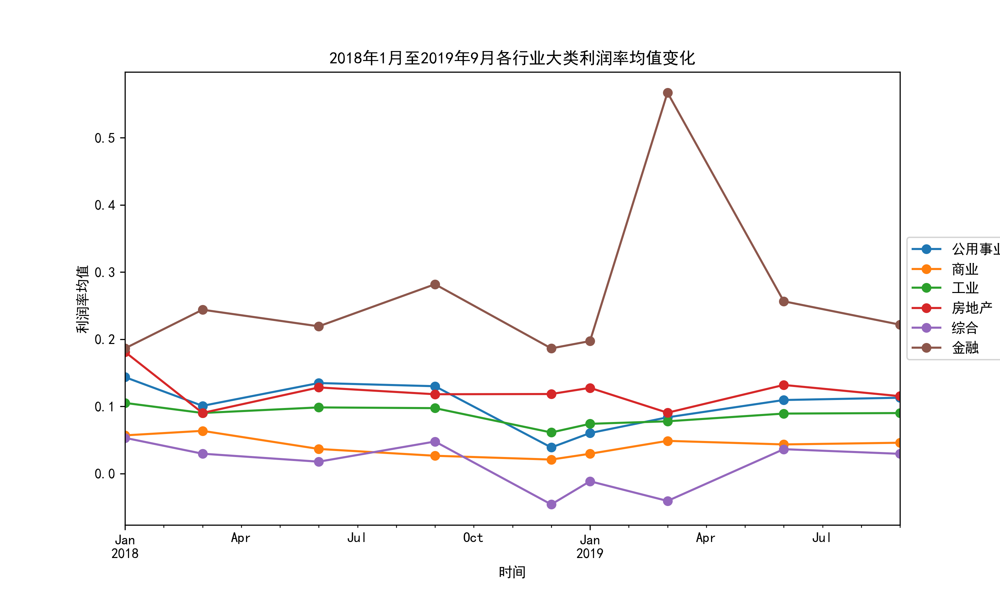
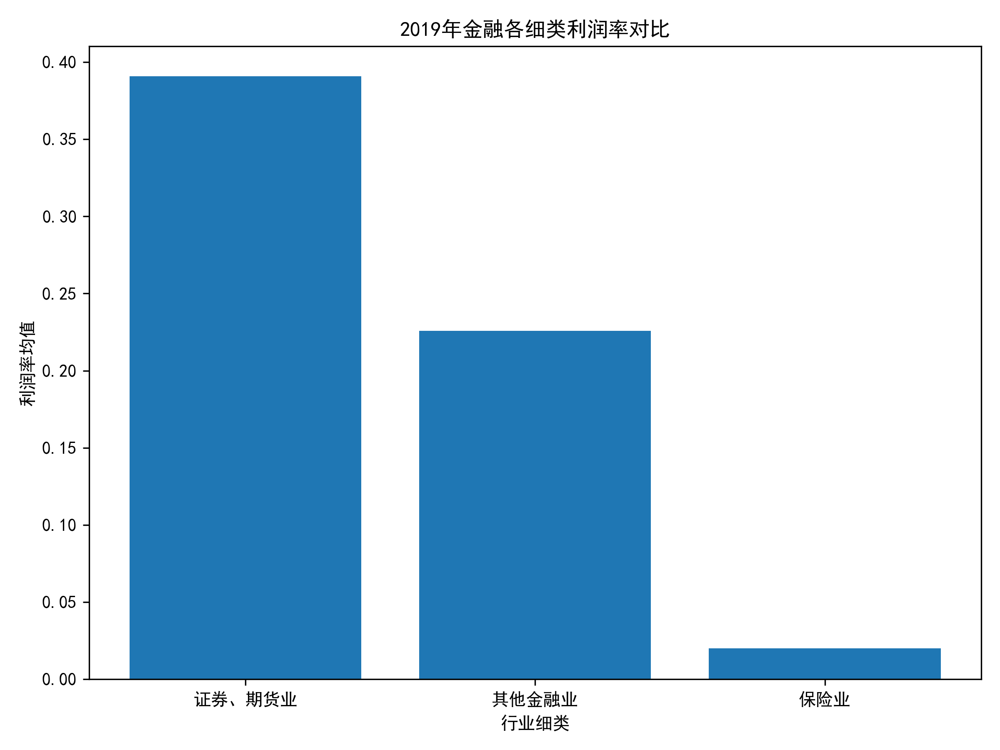
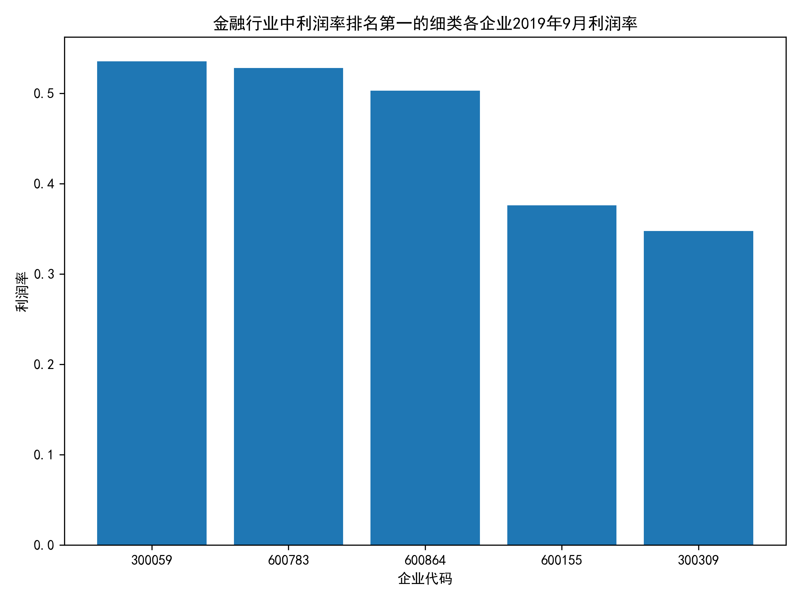
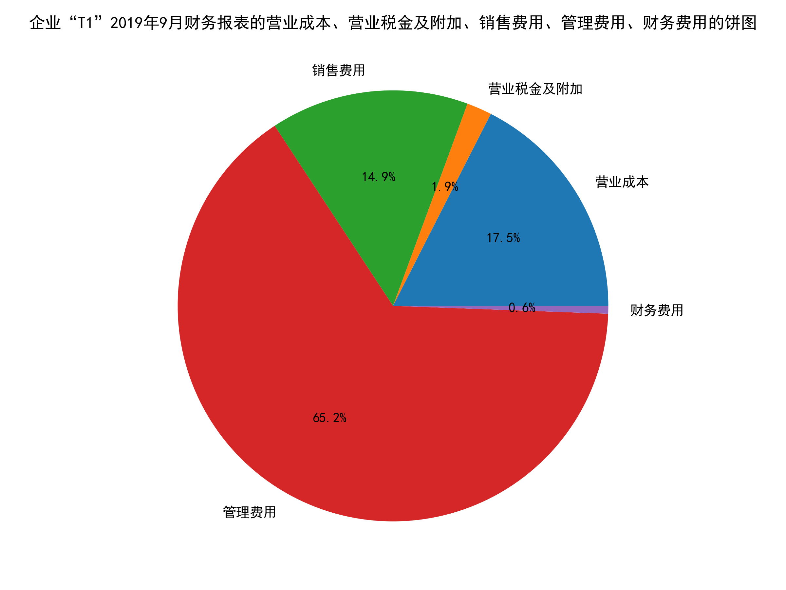
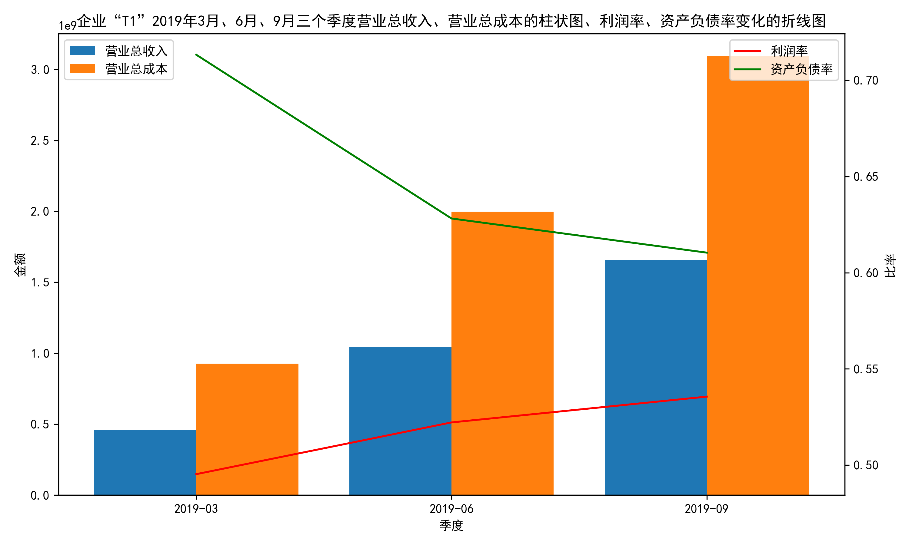
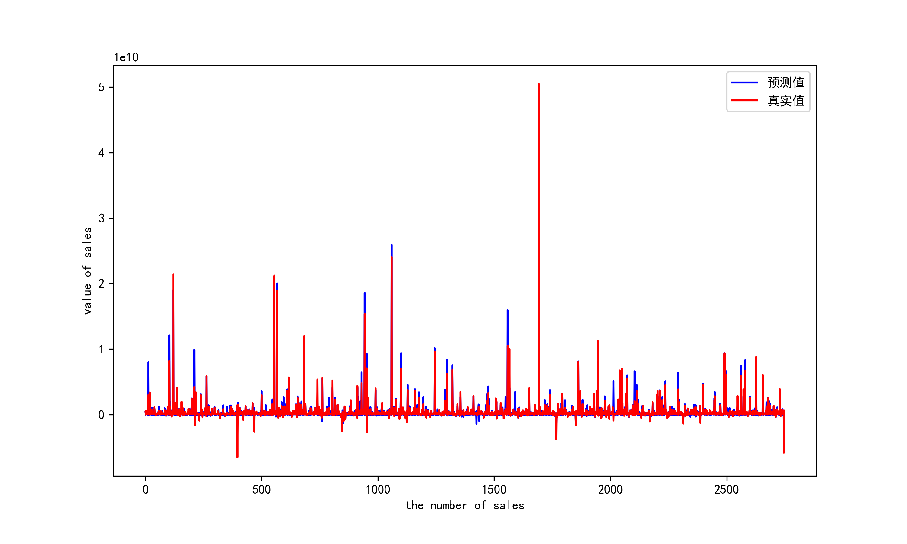
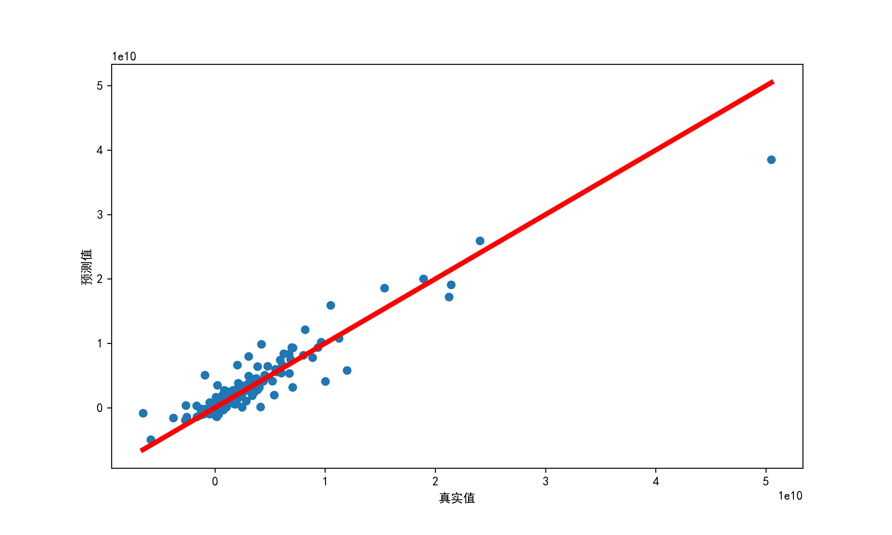
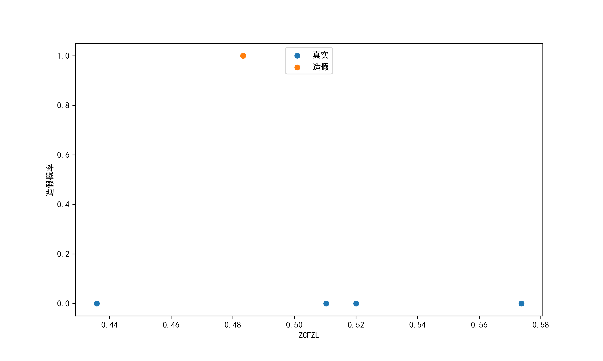

## 2023泰迪杯数据分析技能赛

**B题：企业财务数据分析与造假识别**

赛题描述

**一、背景**

财务数据是指企业经营活动和财务结果的数据记录，反映了企业的财务状况与经营成果。对行业、企业的财务数据进行分析，就是要评价其过去的经营业绩、衡量现在的财务状况、预测未来的发展趋势。财务数据分析不仅对企业生产经营管理有着重要的作用，而且对企业外部投资、贷款、赊销等决策有重要作用；经济管理部门也可以通过财务数据分析了解行业经济的运行状况，合理配置资源，科学调控经济运行，促进经济高质量发展。而财务造假则会对企业、投资者和整个市场带来极大的危害，准确甄别财务造假企业，帮助投资者识别风险，促进企业诚信经营，对营造良性的市场竞争环境有非常重要的现实意义。

**二、目标**

1. 财务数据预处理。
2. 财务数据指标分析及可视化。
3. 建立企业利润预测模型，预测企业营收情况；并根据财务报表数据的特点，筛查财务造假的企业。

### Author

By 云淡风轻 肇庆学院 202124114132

QQ:1026771081
